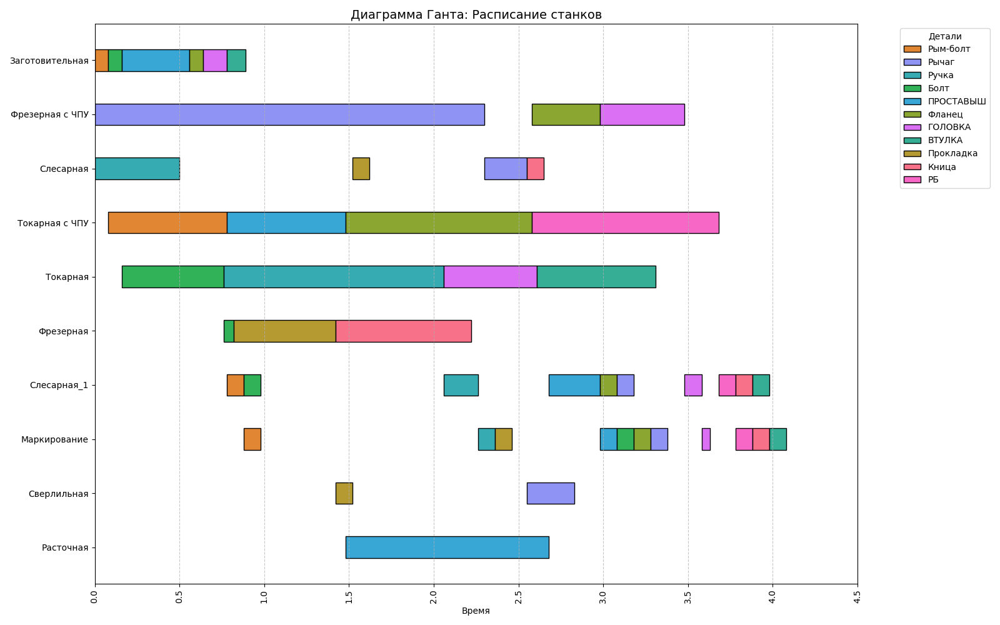

# 🧬 Генетический алгоритм для планирования загрузки станков (Flexible Job Shop Scheduling Problem)

Этот проект решает задачу **гибкого производственного планирования (FJSSP)** с помощью **генетического алгоритма (GA)**. Цель — найти оптимальное расписание выполнения операций над деталями на различных станках так, чтобы минимизировать общее время выполнения (makespan).

---

## 🧠 Задача

- Есть **11 деталей** (работ): `Фланец`, `Прокладка`, `Болт`, `Рычаг` и др.
- Каждая деталь имеет несколько **операций**, которые должны быть выполнены в строгом порядке.
- Для каждой операции доступно **несколько станков**, каждый с разным временем обработки.

Цель: Найти такое расписание, которое сводит к минимуму **общее время завершения всех операций**.

---

## 🛠 Реализация

### Алгоритм:
- **Представление индивида**: 
  - Последовательность операций (с учётом порядка внутри работы)
  - Назначение станков для этих операций
- **Кроссовер**: пользовательская реализация `cxOrdered` для корректного пересечения последовательностей
- **Мутация**: два типа — изменение порядка операций и замена назначенного станка
- **Селекция**: турнирная (`tournsize=3`)
- **Оценка**: моделирование расписания с проверкой последовательности операций и времени занятия станков

---

## 🎯 Цель

Минимизация **makespan** — времени завершения самой последней операции в расписании.

---

## 📊 Пространство решений

Число возможных допустимых решений огромно:


Итого:


> 💥 Это **абсолютно невозможно** перебрать полным перебором даже теоретически.

---

## ⏱️ Параметры запуска

- Размер популяции: `200`
- Число поколений: `5000`
- Вероятность кроссовера: `0.9`
- Вероятность мутации: `0.5`

---

## 🖼 Результат: Диаграмма Ганта

На диаграмме:
- Ось X — время выполнения операций
- Ось Y — станки
- Каждая **деталь** отрисована **своим цветом**
- Все её операции — этим же цветом
- Легенда содержит только уникальные названия деталей

Пример диаграммы:


---

## 🚀 Как запустить

### Требования:
```bash
pip install deap matplotlib seaborn numpy